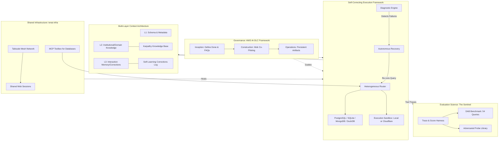

# The Oracle Forge: Cracking the 38% DAB Ceiling with Multi-Layer Context

Bio: We are cracking the 38% DAB ceiling via multi-layer context! Follow our Signal Corps for live technical insights and updates from our engineering journey.

## Author: Signal Corps — Team Gemini / Oracle Forge

---

## Published on

| Platform | URL | Date |
|----------|-----|------|
| X (Twitter) | Team Gemini First Thread [https://x.com/GeminiTrp1/status/2042522406699360407?s=20] | 2026-04-10 |

---

Introducing #TheOracleForge: Our two-week mission to bridge the gap between "clean demos" and production-grade data agents. We are engineering a systemic architecture inspired by the #ClaudeCodeLeak. (1/7) 🧵🧵

Oracle Architecture

---

The core bottleneck in AI is context, not query generation. Oracle Forge implements a minimum of 3 multi-layer (memory schema, domain knowledge, & correction loop) context architecture. We are using these layers to understand the true "why" behind every answer. (2/7)

---

Real enterprise data is messy. Our self-correcting execution framework handles four heterogeneous databases—PostgreSQL, MongoDB, SQLite, and DuckDB—in a single session. If a query fails, the agent diagnoses the error and recovers autonomously via a closed-loop loop. (3/7)

---

For reliability, we are deploying the Sentinel Pattern that is a persistent harness that traces every tool call, scores result against the #DataAgentBench (DAB), & ensures measurable improvement. We are targeting the 38% ceiling set by 'Gemini 3 Pro' for frontier models! (4/7)

---

Development is governed by the AWS AI-DLC framework. This ensures "documentation-first" engineering across three phases: Inception, Construction, and Operations. No code is written without full team intent. We operate through #CompoundEngineering. (5/7)

---

Drivers ( @ENebiyu50445 &  @d_derib) steer the code, Intelligence Officers (Chaile & Liul) curate Karpathy-style Knowledge Bases, and Signal Corps (Rafia & Nuhamin) bring back global technical intelligence. Every role's output becomes an input for the next, multiplying our value.
Our team collaborates in a live, multi-device environment using #Tailscale mesh networking and #MCP Toolbox for standard database interfaces, powered by tenai-infra. Follow us as we build on
[Data Agent Forge Repository](https://github.com/Deregit2025/data-agent-forge)

#AI #DataEngineering #OracleForge #FDE (7/7)
